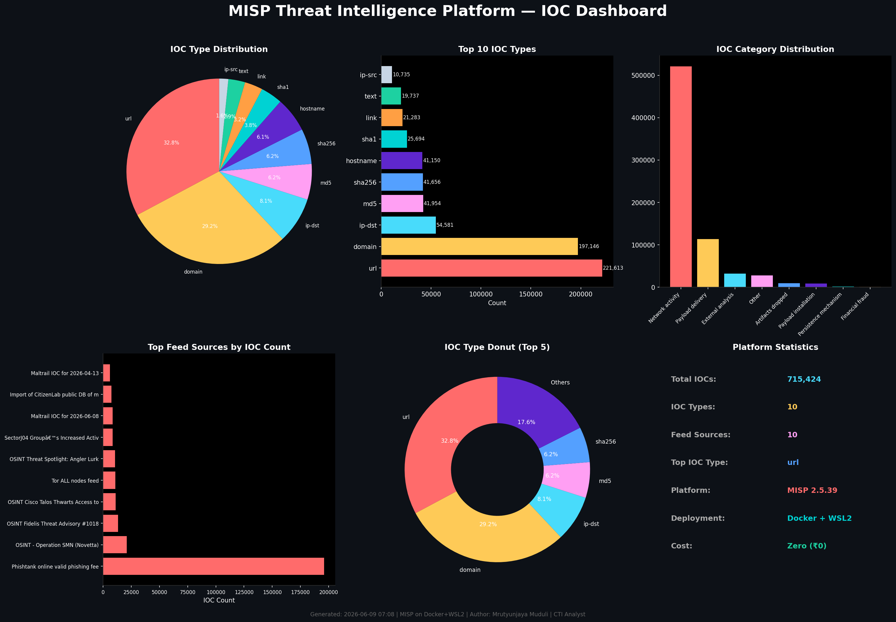

# MISP Threat Intelligence Platform

A zero-cost Threat Intelligence Platform built on MISP with live IOC feeds and enrichment modules, deployed on Windows 11 via Docker + WSL2.

## Stack
- MISP 2.5.39, Docker, WSL2, MariaDB, Redis

## Features
- 700000+ live IOCs from open-source feeds
- 9 enrichment modules (VirusTotal, CIRCL PassiveDNS, CIRCL PassiveSSL, DNS, IPASN, Hashlookup, CVE, ThreatMiner, CountryCode)
- REST API for programmatic IOC lookups
- CLI search script

## Setup
- Install WSL2 + Docker Desktop on Windows 11
- cp template.env .env and configure
- sudo docker compose up -d
- Access at https://localhost

## Author
Mrutyunjaya Muduli | CTI Analyst | 6 Years Experience

## Dashboard Preview

## Automated IOC Ingestion from Excel
Fill ioc_intel.xlsx with your research and run:
python3 misp_ingest.py
Columns: indicator, ioc_type, threat_actor, threat_type, confidence, first_seen, last_seen, country_origin, targeted_country, targeted_region, targeted_sector, associated_malware, associated_cve, tags, source, reference_url, notes
